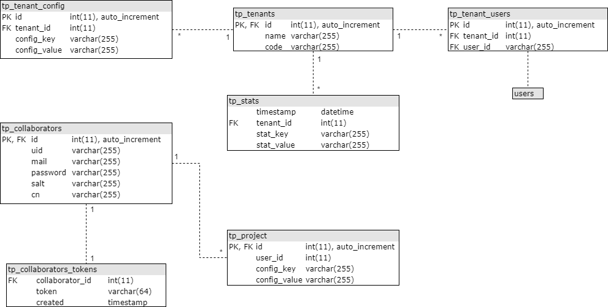

# Tenant Portal

The Tenant Portal is an ownCloud application designed to allow institutions access to manage their users and provide self service functionality.

## Resources
| Name | Location |
| -------- | -------- |
| Git Repository | https://github.com/AARNet/tenant_portal |
| ownCloud Developer Manual | https://doc.owncloud.org/server/latest/developer_manual/app/ |
| ownCloud API Documentation	| https://doc.owncloud.org/api/ |
| ownCloud Coding Style & General Guidelines | https://doc.owncloud.org/server/latest/developer_manual/general/codingguidelines.html |

## Functionality
### Proposed
* Better errors for add/remove
* Autocomplete for usernames
* Calculate amount of storage quota used and deny actions based on this
* Add a customer relations/service desk view of tenants to remove reliance on admin privileges
* Add automatic expiration of authorised users
* User account locking

### Admin only
* Create new tenant
* Delete tenant
* Assign a specific user to a tenant
* Set purchased quota
* Authorise a user to use the tenant portal
* Assign a domain to a tenant
* Enable/disable the ability to impersonate a user

### Authorised Users
* View statistics
* View users (and their quota, used quota and last login)
* Impersonate a user (if enabled on the tenant)
* Change a users available quota
* Create/delete user groups (used for easily sharing to a group of users)
* Create/delete collaborators
* Manage group drives
    * Create/Delete
    * Manage group members
    * Set quota available to group drive
    * View used quota
* View tenant details (authorised users, purchased quota, assigned domains, etc)
* View the audit log

## Technical Documentation
### Database Overview

[Draw.io XML](docs/tenant_portal_database.xml)

### Group Drives
The current group drives work as follow:
* The host user is created as a collaborator and ownCloud user (format: `p-<tenant short code>-<name of group>`).
* The host user has a quota set on it (this provides the storage limit).
* The host user has a single folder (named after the group) which will be where all data is stored.
* When a group member is added to the group drive, the folder is shared directly to them.
    * By sharing directly to the user, we will be able to provide different access permissions in future (ie. read/write/share)
* When a group member is removed from the group drive, the folder is unshared from them.

The legacy version of group drives (prior to the Tenant Portal) worked as follows:
* The host user was created as a CloudStor Hosted Virtual Account (collaborators didn't exist at this time, format: `CloudStorVHO-<name of group>`)
* The host user has a quota set on it (this provides the storage limit).
* The host user has a single folder (named after the group) which will be where all data is stored.
* A User Group was created with the same name as the group.
* A single folder was created in the host user with the name of the group.
* The folder was shared to the user group.
* Group members were added/removed from the user group to get access to the data.

### Configuration

Edit: 

./lib/managers/projectmanager.php
./lib/service/collaboratorservice.php

to update the email address you want to use.

Update:

./templates/mail/collaborator.new.php
./templates/mail/collaborator.new.plain.php

to tweak the email that is sent out to new collaborators.

## License
BSD 3-Clause License

Copyright (c) 2018, AARNet
All rights reserved.

Redistribution and use in source and binary forms, with or without
modification, are permitted provided that the following conditions are met:

* Redistributions of source code must retain the above copyright notice, this
  list of conditions and the following disclaimer.

* Redistributions in binary form must reproduce the above copyright notice,
  this list of conditions and the following disclaimer in the documentation
  and/or other materials provided with the distribution.

* Neither the name of the copyright holder nor the names of its
  contributors may be used to endorse or promote products derived from
  this software without specific prior written permission.

THIS SOFTWARE IS PROVIDED BY THE COPYRIGHT HOLDERS AND CONTRIBUTORS "AS IS"
AND ANY EXPRESS OR IMPLIED WARRANTIES, INCLUDING, BUT NOT LIMITED TO, THE
IMPLIED WARRANTIES OF MERCHANTABILITY AND FITNESS FOR A PARTICULAR PURPOSE ARE
DISCLAIMED. IN NO EVENT SHALL THE COPYRIGHT HOLDER OR CONTRIBUTORS BE LIABLE
FOR ANY DIRECT, INDIRECT, INCIDENTAL, SPECIAL, EXEMPLARY, OR CONSEQUENTIAL
DAMAGES (INCLUDING, BUT NOT LIMITED TO, PROCUREMENT OF SUBSTITUTE GOODS OR
SERVICES; LOSS OF USE, DATA, OR PROFITS; OR BUSINESS INTERRUPTION) HOWEVER
CAUSED AND ON ANY THEORY OF LIABILITY, WHETHER IN CONTRACT, STRICT LIABILITY,
OR TORT (INCLUDING NEGLIGENCE OR OTHERWISE) ARISING IN ANY WAY OUT OF THE USE
OF THIS SOFTWARE, EVEN IF ADVISED OF THE POSSIBILITY OF SUCH DAMAGE.
